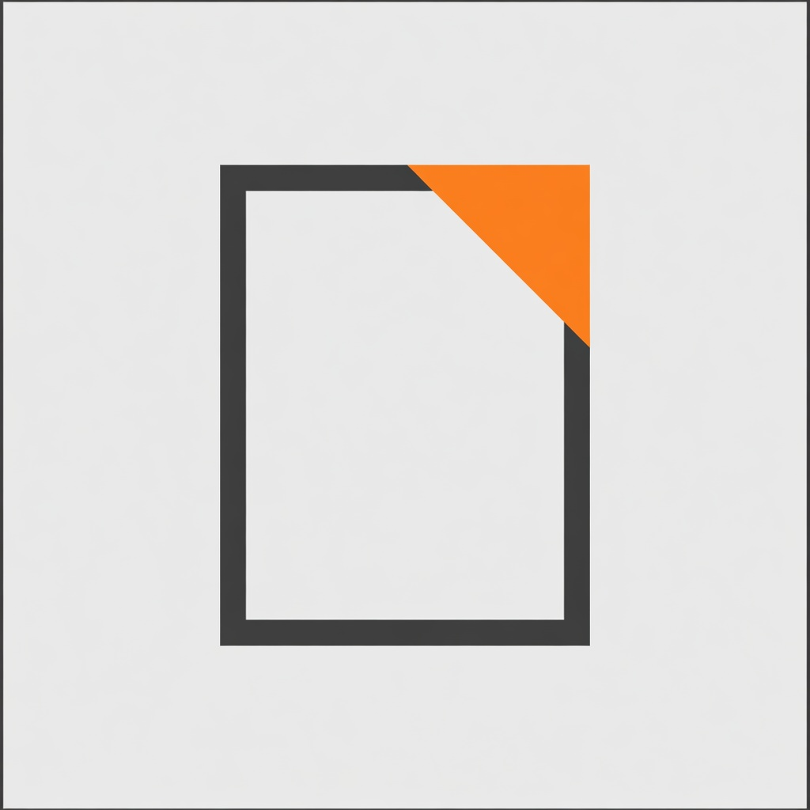
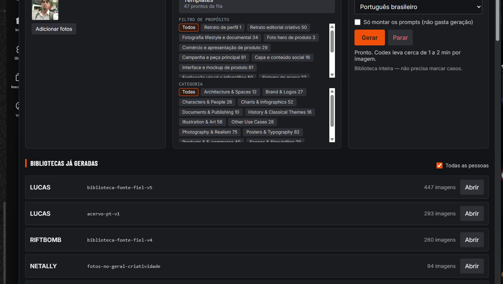

<p align="center">
  
</p>

<h1 align="center">Estúdio</h1>

<p align="center">
  Janela em Rust para uma fábrica de imagens. Escolhe a pessoa, as fotos,
  o tipo de uso e dispara Grok Imagine ou Codex.
</p>

<p align="center">
  
  
  
</p>



## Por que existe

A fábrica já rodava na linha de comando. 517 casos da biblioteca fonte,
dois provedores, texto em português, retoma sozinha se cair. O problema
era o mesmo de sempre: o comando certo fica num arquivo, a galeria noutro,
e abrir uma leva velha pede caminho de pasta.

O Estúdio é essa fábrica com cara de app.

## O que faz

- **Pessoa e fotos.** Cria um alvo, cola as fotos de referência. Arquivo
  morto (atalho vazio, Git LFS sem baixar) é ignorado.
- **Tipo de uso.** Biblioteca inteira (517 casos, fonte-fiel), até 20
  casos escolhidos, ou os 47 templates da fila.
- **Disparo.** Codex, Grok ou os dois. Idioma da peça em português
  brasileiro por padrão. Dá para só montar os prompts, sem gastar geração.
- **Acompanhamento.** Log ao vivo, tempo decorrido, galeria que enche
  conforme a peça sai. Parar mata a fila de verdade.
- **Levas antigas.** Lista o que já foi gerado, com data, agrupado por
  pessoa. Abrir monta o HTML lado a lado (Grok | Codex) no navegador.
  Leva sem arquivo no disco aparece marcada, sem botão de abrir.

Cada imagem Codex leva cerca de 1 a 2 minutos. Uma biblioteca inteira
são horas. Isso é o provedor, não a janela.

## Como rodar

Precisa de Rust, Python 3.11+ com `httpx` e `Pillow`, e o 9Router local
ligado (é de lá que saem as credenciais, o app nunca grava token).
Instale também as skills de
[`LucasOl-Skills`](https://github.com/LucasOl1337/LucasOl-Skills); o app resolve
`imageproductionfactory` em `~/.agents/skills` ou por `LUCASOL_SKILLS_REPO`.

```
cd apps/factory-studio
cargo run
```

A janela abre sozinha. Guia completo: [GUIA.md](GUIA.md).

## O que este repo não traz

Não vem acervo de ninguém. Fotos, produções e alvos pessoais ficam
na tua máquina, em `ALVOS/<NOME>/`. O clone público é o motor e a
biblioteca de casos/templates.

## Licença

MIT. Biblioteca de casos vem do [awesome-gpt-image-2](https://github.com/freestylefly/awesome-gpt-image-2).
